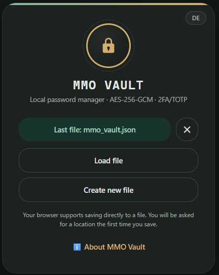
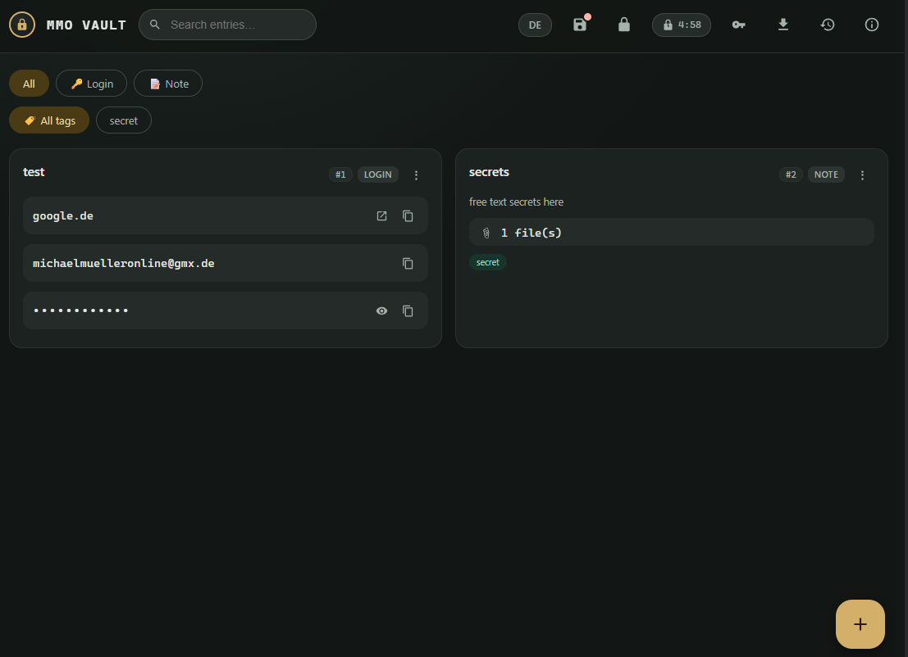

# MMO Vault

**A password manager in a single HTML file.** No installation, no dependencies — the vault is an encrypted file that belongs to you and that you store yourself. Double-click it and it works, with no server anywhere.

> **Version 2.1.0** · **The server signs you in through your identity provider.** Microsoft 365, Google or any OIDC provider; an allowlist per provider decides who gets in; groups can be mirrored from the provider. No passwords, no passkeys, no configuration file — two environment variables, everything else in the database. Vaults shared with a team and an unlimited file history as before. The application file stays exactly the same — the service delivers it with two changes and otherwise only stores what the browser has already encrypted. It never sees a master password or a key.
>
> The local file is unaffected and keeps its promise literally: its policy forbids *every* connection, and the file contains neither a URL nor a `fetch` call.
>
> **Still open, and only checkable by hand:** OIDC against Microsoft 365 and Google with real credentials, including group mirroring; behaviour behind the reverse proxy of the target environment; the auto-lock timeout; keyboard-only operation; and the fallbacks without the File System Access API and without `BarcodeDetector`. The current state is a checklist in [docs/requirements.md](docs/requirements.md#9-abnahmekriterien).

---

## What it looks like

| Unlocking | Working |
|---|---|
| [](docs/login_screen.png) | [](docs/main_screen.png) |
| Start without any decrypted data: most recently used file, load, or create a new one. | One card per entry, full-text search with field filters, tags, type filter, and the auto-lock countdown. |

---

## Getting started

1. Download [mmo_vault/public_html/mmo_vault.html](mmo_vault/public_html/mmo_vault.html).
2. Open the file in a browser (a double-click is enough — no web server required).
3. **Create a new file**, choose a master password, add entries, **Save**.

On the first save the browser asks for a location. From then on the application writes directly into that file. Browsers without the File System Access API download a file each time instead.

---

## Deploying with Docker

```bash
docker compose up -d --build                     # → http://127.0.0.1:4080/
docker compose --profile server up -d --build    # → http://127.0.0.1:4081/
```

Without the profile nothing changes: one container, nginx, one file. The
service is a second target in the same Dockerfile and only comes into being
when asked for. See [The server variant](#the-server-variant).

Or without Compose:

```bash
docker build -t mmo-vault:2.1.0 .
docker run -d --name mmo-vault --restart unless-stopped \
  -p 127.0.0.1:4080:8080 \
  --read-only --tmpfs /tmp --cap-drop ALL \
  --security-opt no-new-privileges:true \
  mmo-vault:2.1.0
```

Port and bind address can be set without editing compose.yaml:

```bash
VAULT_PORT=4080 VAULT_BIND=127.0.0.1 docker compose up -d
```

### Installing on a server

There is no build step and no registry dependency — four files are enough:

```bash
# On the server
mkdir -p /opt/mmo-vault && cd /opt/mmo-vault

# Transferred from the workstation (build context, ~140 KB)
rsync -av --relative \
  ./Dockerfile ./compose.yaml ./docker/nginx.conf ./mmo_vault/public_html/ \
  server:/opt/mmo-vault/

# Build and start on the server
cd /opt/mmo-vault
docker compose up -d --build
```

If you would rather not build on the server, transfer the finished image instead:

```bash
docker save mmo-vault:2.1.0 | gzip | ssh server 'gunzip | docker load'
```

**Starting after a reboot** comes from `restart: unless-stopped` in compose.yaml — but that only takes effect if the Docker service itself starts at boot:

```bash
sudo systemctl enable --now docker
systemctl is-enabled docker        # must say "enabled"
```

No separate systemd unit is needed. `unless-stopped` means: after a crash or reboot the container comes back on its own, after a deliberate `docker compose stop` it stays down.

### Reachable only from inside

Binding to `127.0.0.1` in compose.yaml is the actual access restriction — not the firewall:

> **Docker bypasses ufw and firewalld.** With a publication such as `-p 4080:8080` (no address), Docker inserts its own iptables rules **ahead of** the firewall's chains. The port would then be reachable from the network even though `ufw status` shows it as blocked. With `127.0.0.1:4080:8080` the rule is never created.

This can be verified on the listening socket — the address must be `127.0.0.1`, not `0.0.0.0`:

```bash
ss -tlnp | grep 4080
# correct: 127.0.0.1:4080     wrong: 0.0.0.0:4080 or *:4080
curl -sI http://127.0.0.1:4080/ | head -1        # from inside: 200
curl -sI --max-time 3 http://<server-ip>:4080/   # from outside: no connection
```

The reverse proxy on the same host then points to `http://127.0.0.1:4080`. If it runs in a container of its own, it can **not** reach the host loopback address — in that case remove the `ports` publication entirely, put both services on the same Docker network and point the proxy at `http://mmo-vault:8080`. The required lines are commented out in [compose.yaml](compose.yaml); without a published port the service is structurally unreachable from outside.

What gets served is [mmo_vault/public_html/](mmo_vault/public_html/); the index is `mmo_vault.html`, configured in [docker/nginx.conf](docker/nginx.conf). The image contains nginx and this one file — no source code, no documentation, no build step.

The container runs as an unprivileged user, listens internally on 8080 (published as 4080), with a read-only root filesystem, without capabilities and with `no-new-privileges`. The server additionally sets `frame-ancestors 'none'` as a real HTTP header — inside the application's `<meta>` tag that directive is ignored by the browser.

### Behind the reverse proxy

The service is meant to be a backend: the proxy terminates TLS and forwards to `mmo-vault:8080`. If the proxy runs on the same host, the loopback publication from [compose.yaml](compose.yaml) fits. If it runs in its own container, remove the publication and put both services on the same Docker network — the required lines are commented out in compose.yaml.

Two things belong on the proxy, not in this image: **HSTS** (`Strict-Transport-Security`) and, if the real client IPs should appear in the log, `X-Forwarded-For` — the matching `set_real_ip_from` block is commented out in [docker/nginx.conf](docker/nginx.conf). All other security headers are set by nginx itself and pass through the proxy unchanged.

> **HTTPS is mandatory, not a convenience.** Browsers only expose `crypto.subtle` **in a secure context**. Over `http://` on a LAN IP or domain the Web Crypto API is missing entirely — the vault could neither be created nor unlocked. `http://localhost` counts as secure, nothing else does.

The application detects this on load and shows a clear notice instead of a cryptic error, with the controls disabled.

### What deployment does not change

In this variant the server only ever sees the application file. Vault files stay exclusively with the user: they are decrypted in the browser and saved through the file dialog — never uploaded. The CSP with `connect-src 'none'` prevents the page from opening any connection back at all.

With the server variant the vault files do live on the server — as ciphertext. What does not change there either is where the decryption happens: in the browser, with a master password the service never receives.

---

## The server variant

Everything above works without any of this. The server exists for the case the
single file cannot cover: **several people, one vault.**

```bash
export MMO_VAULT_DIR=var                 # optional, this is the default
python mmo_vault.py setup                # origin, identity provider, first administrators
python mmo_vault.py start                # the service
```

Or as a container, where the compose profile decides:

```bash
docker compose up -d --build                     # just the file, as before
docker compose --profile server up -d --build    # with the service
docker compose --profile server run --rm mmo-vault-server setup
```

### What it does

- **Sign-in through your identity provider.** Microsoft 365, Google, or any
  provider with OIDC discovery (Keycloak, Authentik, …). The service keeps no
  passwords, no passkeys and no second factor of its own — that is the
  provider's job, together with its policies for MFA and device compliance.
- **An allowlist decides who gets in.** Per provider, one line per e-mail
  address, with an *administrator* flag. There is no self-registration: an
  account comes into being on the first successful sign-in of a listed
  address and is bound to the provider's stable subject from then on.
  Removing the line disables the account and ends its sessions.
- **Groups, local or mirrored.** Administrators manage local groups by hand.
  For Microsoft and Google a switch per provider mirrors the person's own
  groups at each sign-in — with their own token, no service account, no
  directory-wide permission.
- **Sharing.** A vault is shared with people or with groups, read or
  read-write; the wider permission wins.
- **Unlimited file history.** Every save is kept. Restoring writes a *new*
  generation instead of rewinding, so the history stays gapless and the restore
  itself can be undone. Nothing ever expires on its own — the size is shown and
  a person decides what goes.
- **Two layers against lost writes.** A lock keeps two people out of each
  other's way; an ETag decides who wrote last. The lock is advisory, the ETag is
  binding — so a lock that expired unnoticed cannot cause damage.

### What it does not do

It does not decrypt. The service stores blocks of ciphertext, checks that they
are structurally a vault file, and hands them back. The master password is
entered in the browser, the key is derived there, and neither ever leaves it.
After clicking a vault in the list you enter one thing: the master password.

### Configuration: two variables, then the database

The service reads exactly two environment variables:

| Variable | Meaning | Default |
|---|---|---|
| `MMO_VAULT_DIR` | data directory: vault files and, by default, the SQLite database | `var/` next to `mmo_vault.py` (`/app/var` in the container) |
| `MMO_VAULT_DATABASE_URL` | SQLAlchemy URL | `sqlite:///<MMO_VAULT_DIR>/mmo_vault.db` |

Everything else — the public origin, the providers with their client secrets,
the allowlist, session lifetimes, size limits — lives in the database. `setup`
writes the initial state; from then on the administration at **`/admin`**
changes it, and changes take effect without a restart. There is no
configuration file to protect, back up or drift.

### Setting up the provider

At Microsoft or Google, register a web application with the redirect URI
`https://<your-origin>/auth/oidc/<provider-name>/callback` — `setup` prints
it. For Microsoft a concrete tenant is required; the open aliases `common`,
`organizations` and `consumers` are refused, because an address is only
trustworthy if *your* tenant administers it. Group mirroring needs the
delegated permission `GroupMember.Read.All` (Microsoft) or the scope
`cloud-identity.groups.readonly` (Google Workspace) granted to that
application.

### The one change to the file

In server mode the delivered copy differs from the file on disk in exactly two
places: `connect-src 'none'` becomes `connect-src 'self'`, and an inline script
provides the adapter that knows how to talk to the service. What gets added is
readable in plain text at `/api/injection`.

That is what keeps the promise intact for the local file. Download it, open it
offline, and it still cannot open a connection — the policy says so and the
browser enforces it.

> **Worth being clear about:** whoever controls the server can delete vault
> files, roll them back, or inject arbitrary code into the delivered
> application. They cannot read the vaults. Availability and integrity rest on
> the server; confidentiality still rests on the master password alone. For the
> highest bar, the local file remains the right answer.
>
> Whoever controls the identity provider can sign in as any listed address —
> the service trusts the provider's word. That is the deliberate trade: one
> place for identity, MFA and offboarding instead of a second set of
> credentials to lose.
>
> And: everyone who can write to a shared vault knows the same master password.
> Revoking a share takes away access to the server, not the knowledge. After
> revoking, change the master password.

### When the provider is down

The vault files are plain NDJSON on disk, and `python mmo_vault.py export-vault
<name>` prints one — the current state or any generation — to standard output.
Save it, open it with the local file, enter the master password. The provider
being unavailable keeps people out of the *service*, never out of their data.

Group changes at the provider show up at the next sign-in, not before; someone
removed from a group keeps access until their session ends (at most
`session_hours`, default 12). Administrators can revoke sessions at any time.

---

## What's inside

- **AES-256-GCM**, key derived with PBKDF2-HMAC-SHA256 at 600,000 iterations (OWASP recommendation), 16-byte salt, a dedicated 96-bit IV per block
- **Two entry types** — login (URL, username, password, 2FA, notes) and free text
- **Custom fields on free-text entries** — any number of labelled fields, each a line of text, a password or a multi-line block. On the card every field is one row; tapping it copies the value (passwords masked, revealable, cleared from the clipboard after 30 s). They are versioned, duplicated and searched (labels and non-password values) like everything else
- **2FA/TOTP** per RFC 6238, including 8-digit as well as SHA-256/SHA-512 accounts. QR codes can be imported as an image via the native `BarcodeDetector` API
- **File attachments** in their own encrypted blocks — they are only decrypted on download, not already on unlock
- **Tags, full-text search and type filter**, plus field filters in the search: `id=42`, `tag=work`, `typ=freitext`, `benutzer=admin`, `titel=bank` (the filter keys are German, matching the interface) — freely combinable. Values containing spaces go in quotes: `tag="my tag"`; a quoted string without a key searches for that phrase
- **Sequential entry number** on every card; tapping it copies the search expression
- **Deep link** via `#search=id%3D42` — as a fragment, so the search term never ends up in the server log
- **Duplicating entries**, including independent copies of the attachments
- **CSV import** for login and free-text entries. Fixed column names, documented in the dialog, with a downloadable template:

  | Column | Meaning |
  |---|---|
  | `title` | Required; rows without a title are skipped |
  | `type` | `zugang` or `freitext`; if the column is missing, the choice in the dialog applies |
  | `url`, `username`, `password` | login entries only |
  | `totp` | 2FA secret in Base32; invalid ones are discarded and reported |
  | `notes` | for free text the content, rendered as Markdown |
  | `tags` | several separated by a vertical bar: `work\|cloud` |

  Column names are English only — German names are not recognised. The delimiter is detected automatically, and duplicates can be skipped on request. The import only changes what is in memory — writing to the file still requires an explicit save.
- **Markdown in free-text entries** — headings, nested lists, tables with column alignment, code, quotes, links. The renderer builds DOM nodes exclusively, never `innerHTML`; images and embedded HTML are excluded
- **Record versions** — every change keeps the state *before* it. Each card shows `History (n)`; the dialog lists what changed field by field, reveals old values on demand and restores them either wholesale or one field at a time. Restoring keeps a version of its own and can therefore be undone
- **Trash** for deleted entries. Restoring brings back the original sequential number, so an old deep link points at the same entry again
- **Nothing expires on its own.** Versions and deleted entries are kept until you remove them. Instead of a deadline, the application warns once the file grows past 5 MB and shows how much of it is history — **Manage versions** in the menu deletes in bulk, per entry, by age, or everything, optionally keeping the newest state of each entry
- **Password generator** without modulo bias and without visually ambiguous characters
- **Auto-lock** with a visible countdown, 5 minutes by default
- **Change history**, encrypted along with everything else, containing no secrets
- **German and English**, switchable at any time — including all error messages
- Usable from 320 px up to desktop

---

## Security properties

**No network connection — technically enforced.** The page sets `default-src 'none'; connect-src 'none'`. No CDN, no web fonts, no telemetry. That is not merely a promise but enforced by the browser.

**Locking cleans up.** Keys, entries, history, file handle and TOTP cache are discarded, all dialogs are closed and their fields cleared, revealed passwords are removed from the DOM. Including when auto-lock strikes while an edit dialog is open.

**Saving is verified.** After writing, the file is read back, compared and parsed again. If anything fails, the previous content is restored and the vault stays marked as unsaved. A cancelled save dialog does not trigger a silent download.

**Copied secrets expire.** Passwords and 2FA codes disappear from the clipboard after 30 seconds. URL and username stay, so the application does not overwrite clipboard content it did not put there.

**Versions are secrets and are treated as such.** Kept states live in the same AES-256-GCM blocks as everything else, disappear on locking, and are re-encrypted along with everything else when the master password changes. The separate change history stays free of secrets, as before. Worth knowing: a password that was replaced remains readable in the history — that is the point of the feature, but it extends how long a compromised password lives on in the file. The entry dialog offers to discard the affected versions.

**Old files are upgraded.** When a vault with an outdated iteration count is opened, the application raises it to the current standard right after unlocking and marks it for saving.

The full threat model — including what the application explicitly does **not** protect against — is in [docs/requirements.md](docs/requirements.md#35-bedrohungsmodell).

---

## Important to know beforehand

> **Backups are mandatory, not optional.** The application versions nothing. The rollback protection covers interrupted writes — not deleted files, storage failures or sync conflicts.

> **There is no password recovery.** No reset, no back door. If the master password is gone, the data is gone.

> **Cloud sync folders:** Nextcloud, OneDrive and Dropbox swap files internally, which can leave stored file handles pointing at nothing. The application detects this and clears the handle. Editing in parallel on several devices is not supported.

> **No warranty.** A self-built tool for personal projects, not audited security software.

---

## Browser support

| Feature | Chrome / Edge | Firefox | Safari |
|---|---|---|---|
| Encryption and decryption, TOTP | ✅ | ✅ | ✅ |
| Saving directly into a file (FSA) | ✅ | download fallback | download fallback |
| Remembering the last file | ✅ | — | — |
| QR code import (`BarcodeDetector`) | ✅ | — | — |

If an optional capability is missing, the application falls back and says so: download instead of direct saving, manual entry instead of a QR scan.

---

## File format

NDJSON, one line per block — each line parsable on its own:

```
{"type":"header","format":"mmo-vault-v3","salt":"…","iterations":600000}
{"type":"text","iv":"…","data":"…"}
{"type":"vers","iv":"…","data":"…"}
{"type":"file","id":"…","iv":"…","data":"…"}
```

The header is unencrypted and contains nothing but the derivation parameters. The text block carries entries, history and settings. Versions and attachments sit next to it as separate blocks — which is why unlocking stays fast even with years of history and large files: neither is decrypted until something actually needs it. Files in the old v1 and v2 formats are read as they are.

A vault stays **v2** until it holds its first version, so an unchanged file does not change its format.

> **Careful with version 1.8.0 and older.** Those versions open a v3 file without complaint but drop every `vers` block when saving — the history is then gone, without a message. This cannot be fixed retroactively, because 1.8.0 has already shipped. Either update everywhere, or do not edit a v3 file with an older version.

Full specification: [docs/requirements.md](docs/requirements.md#5-dateiformat).

---

## Project structure

```
mmo_vault/
├── mmo_vault.py             CLI entry point: setup, start, export-vault
├── mmo_vault/
│   ├── public_html/
│   │   └── mmo_vault.html   The complete application (= served directory)
│   ├── server/              The service: FastAPI, models, routers, templates
│   └── migrations/          Alembic
├── docker/
│   └── nginx.conf           Static server, index set to mmo_vault.html
├── docs/
│   ├── requirements.md      Requirements, file format, threat model, acceptance
│   ├── plan_versioning.md   Design of the record versioning (2.0.0)
│   ├── plan_server.md       Design of the server variant (2.0.0)
│   └── plan_oidc_only.md    Identity from the provider, config in the DB (2.1.0)
├── tests/                   pytest, for the server only
├── Dockerfile               Two targets: static and server
├── compose.yaml
├── requirements.txt
└── LICENSE
```

**The application still has no build step and no dependencies.** To change
something, open the HTML file in an editor. The server is a separate matter:
Python, `pip install -r requirements-dev.txt`, `pytest`.

---

## Licence and origin

See [LICENSE](LICENSE). Developed by Michael Müller as part of the MMO tool series for personal projects.
